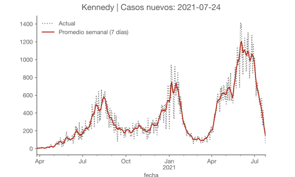
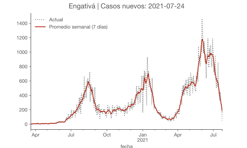
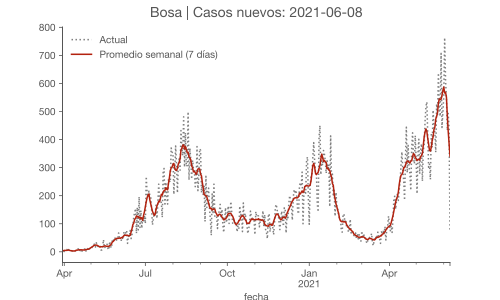
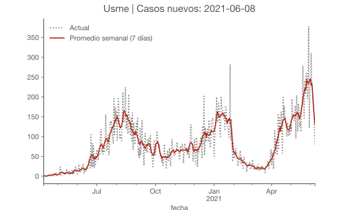
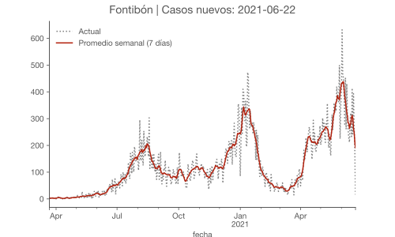
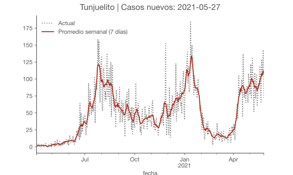
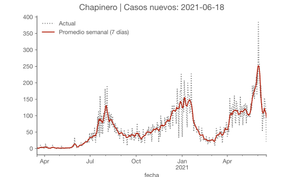
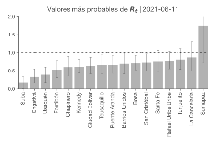
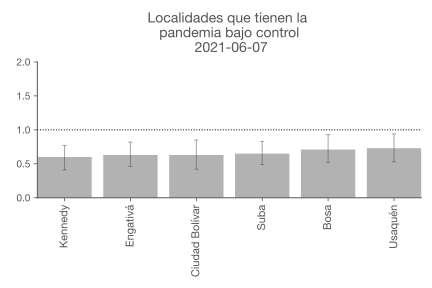
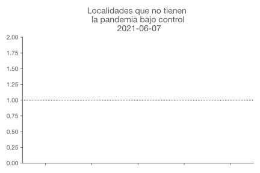

<meta name="viewport" content="width=device-width, initial-scale=1.0">

# Análisis de la pandemia COVID-19 en 🇨🇴 Bogotá a nivel de localidad | Rt

por Daniel Cárdenas

Si Rt > 1, el número de casos aumentará, como al comienzo de una
epidemia. Cuando Rt = 1, la enfermedad es endémica, y cuando
Rt < 1 habrá una disminución en el número de casos.

Entonces, los epidemiólogos usan Rt para hacer recomendaciones de
políticas. Es por eso que este número es tan importante.

## Notas

Hay varios registros de infectados en el datos del Distrito donde no tienen
datos o la persona infectada no es reside en Bogotá.

Mi modelo es una adaptación del model de
[Kevin Systrom](https://github.com/k-sys/covid-19)

## Fuente de Datos

Mi fuente de datos es la plataforma de Datos Abiertos de Bogotá.

- [Número de casos confirmados por el laboratorio de COVID- 19 - Bogotá D.C.](https://datosabiertos.bogota.gov.co/dataset/numero-de-casos-confirmados-por-el-laboratorio-de-covid-19-bogota-d-c)

### Casos y Promedios Semanales

### Rt de localidades en Bogotá

